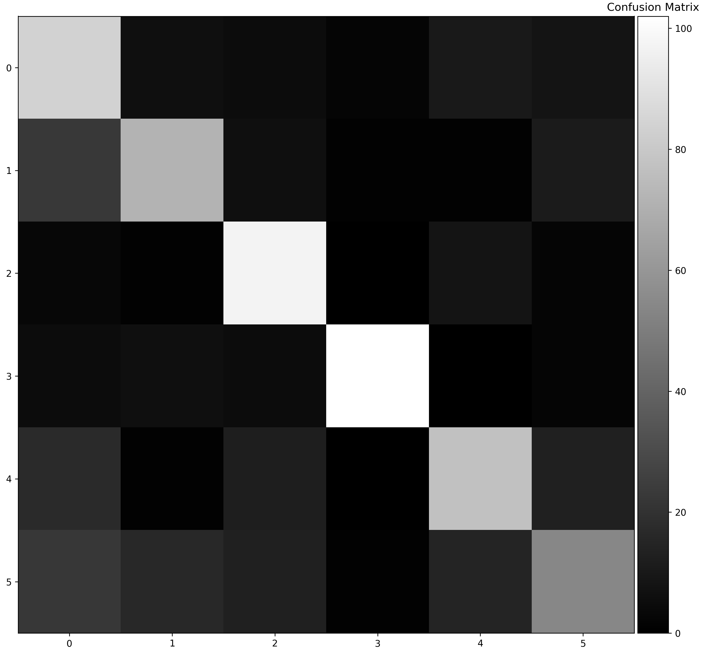
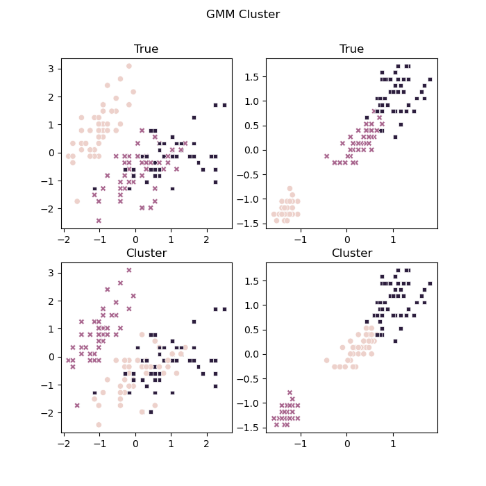
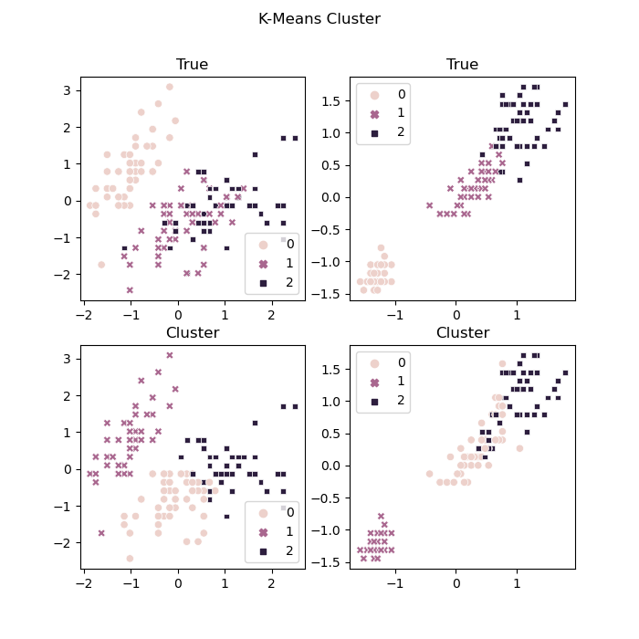

# USTC CS Machine Learning Course Projects

This repository contains the implementation of some classical machine learning algorithms from scratch, for the course projects of USTC CS Machine Learning.


**Requirements**:

```
numpy
scikit-learn
matplotlib
pandas
seaborn
```

## Project 1: SVM Classifier based on SMO Algorithm

This project realized a linear classifier based on the Support Vector Machine (SVM) model, using Sequential Minimal Optimization (SMO) algorithm to optimize super parameters.

- Dataset: [face.xlsx](./svm-smo/face.xlsx) is serial human face emotion data and labels. The dataset itself is not so large.

- Baseline: Built-in SVM Classifier algorithm in scikit-learn library.

- Result: Classification accuracy ~ 70% through cross validation.

**Running and result**:

In [svm-smo/](./svm-smo/) folder, run the python script `python svm-smo.py` to see the result:

```shell
(base) rose@rose:svm-smo$ python svf-smo.py 
Confusion Matrix of Train Data (cross validation):
[[ 84   6   5   2  10   8]
 [ 23  72   6   1   1  11]
 [  3   1  97   0   8   2]
 [  5   6   5 102   0   2]
 [ 17   1  12   0  77  13]
 [ 22  16  13   1  15  54]]
confusion matrix of test data:
[[40  5  1  0  3  3]
 [ 0 49  0  2  0  2]
 [ 0  0 37  0  4 15]
 [ 0 14  1 31  0  1]
 [ 8  0  1  0 26 12]
 [ 8  9  1  0  4 24]]
 accuracy of test data: 0.6877076411960132
```

| Confusion matrix on trainset                | Confusion matrix on testset                 |
| ------------------------------------------- | ------------------------------------------- |
|  |  |


## Project 2: GMM for clustering based on EM algorithm

This project realized the Gaussian Mixture Model (GMM) for unsupervised clustering, based on the Expectation Maximization (EM) algorithm.


See [gmm-em/](./gmm-em/) folder for details, including source code, dataset and result report.

- Dataset: iris, which can be found in general libraries of Python, R, etc.

- Baseline: Built-in K-Means Cluster algorithm in scikit-learn library.

- Result: The implemented GMM method improves the "RI" value by 10%~50%, in contrast to the built-in K-Means Cluster algorithm.

**Running and result**:

In [gmm-em/](./gmm-em/) folder, run the python script `python gmm-em.py` to see the result:

```shell
(base) rose@rose:gmm-em$ python gmm-em.py 
GMM clustering RI: 0.9574944071588366
KMeans clustering RI: 0.6562863534675615
```

| Clustering effect with our GMM        | Clustering effect with built-in K-Means  |
| ------------------------------------- | ---------------------------------------- |
|  |  |

